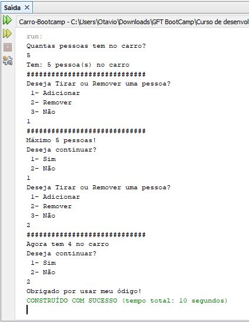

<h1>Sobre:<h1>
  
  Para desenvolver o exercicio utilizei a linguagem JAVA e a IDE Netbeans.
  Coloquei um minimo de 0 pessoas e um máximo de 5 pessoas.

<h1>Terminal</h1>

<h1>Exercicio</h1>

<ul>
  <li>Crie uma classe carro</li>
  <li>Nessa classe você deverá ter a quantidade de pessoas que estão dentro do Carro.</li>
  <li>E também é preciso que tenha uma forma de adicionar e remover pessoas de dentro do carro.</li>
</ul>

